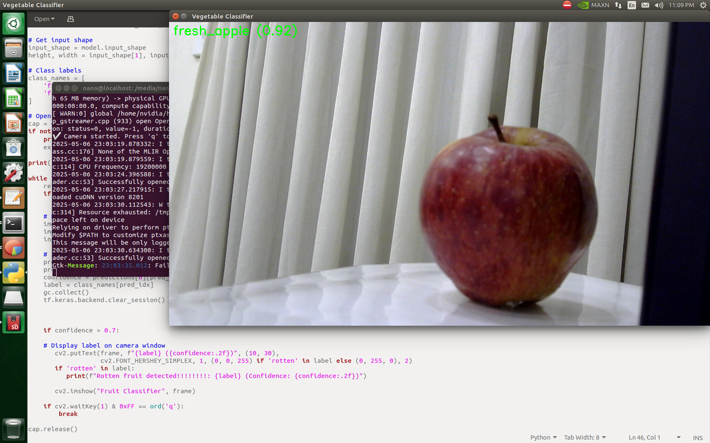
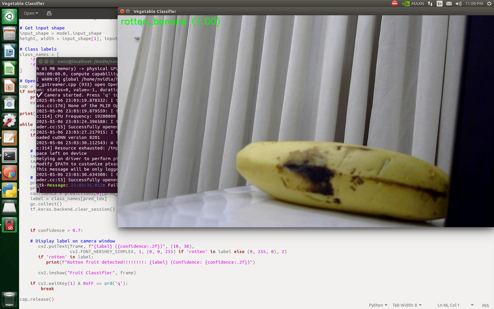
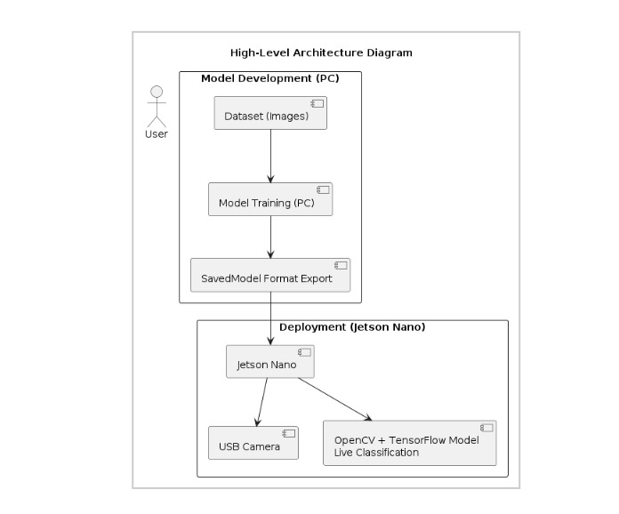

# Real-Time Defective Vegetable Detection using Jetson Nano

A lightweight deep learning system for **real-time classification of fresh vs. stale vegetables** using MobileNetV2, deployed on NVIDIA Jetson Nano. This edge-AI solution enables offline, low-latency inference for smart agriculture and automated food quality control.

> ⚠️ **Note:** This project is still in progress and the model is not fully optimized. Current inference speed and robustness are sufficient for demonstrations but **may not be production-ready**. Optimization steps like TensorRT conversion, pruning, quantization, and better dataset augmentation are recommended before deployment. Also note that if the model lags or causes fps drops, you can remove the finetuning and train it normally for a higher number of epochs

---

## 📌 Features

* 🧠 MobileNetV2 pre-trained and fine-tuned on custom dataset
* 🎥 Live classification via USB camera and OpenCV overlay
* 💡 Handles lighting variations, occlusions, and camera angle changes
* ⚡ Real-time inference on Jetson Nano
* 📦 TensorFlow 2.5 and Python 3.6 optimized for edge deployment

---

## 📽️ Demo




---

## 🛠️ Architecture



---

## 🚀 Installation

Installation instructions have been intentionally removed as this project is still under development. If you wish to run the code, please review the source files and manually set up the environment accordingly.

---

## 🧪 Usage

Usage instructions have been omitted since the system is not finalized. For experimental or educational use, please inspect the codebase in the `src/` directory.

---

## 📂 Project Structure

```
vegetable-defect-detection/
├── src/                  # Python source files
├── saved_models/         # Exported model
├── assets/               # Diagrams, GIFs, screenshots
├── jetson_setup.md       # Setup instructions for Jetson Nano
├── README.md
├── requirements.txt
├── LICENSE
├── .gitignore
```

---

## 📊 Dataset

This project uses a dataset sourced from [Kaggle](https://www.kaggle.com/datasets/swoyam2609/fresh-and-stale-classification). Special thanks to the dataset creator:

> **Dataset Name**: *Fresh and Stale Classification*
> **Creator**: *Swoyam*
> [View Dataset on Kaggle](https://www.kaggle.com/datasets/swoyam2609/fresh-and-stale-classification)
> *(Used under the terms of the dataset’s license)*

---

## 📈 Results

* ✅ Accuracy: **>90%** on test set
* ⚡ Inference time: \~1–2 seconds per frame
* 🧪 Tested under variable lighting and occlusion conditions

---

## 🚧 Limitations & Future Work

* 📷 Sensitive to extreme lighting or unfamiliar fruit types
* 🔄 No on-device learning (training is offline)
* 🍎 Not trained on all fruit and vegetable types — currently supports only apples and bananas
* ⏱️ Model is not yet optimized for deployment; potential improvements:

  * Convert to TensorRT or TensorFlow Lite for faster inference
  * Apply model pruning and quantization to reduce size
  * Train on larger and more diverse datasets
  * Explore batch inference and camera input filtering for stability

---


## 📄 License

This project is licensed under the [MIT License](LICENSE).

---

## 🔖 Tags

`#JetsonNano` `#EdgeAI` `#ComputerVision` `#TensorFlow` `#MobileNetV2` `#Python` `#AgriTech` `#OpenCV` `#TensorFLow 2.5` `#whl file` `#aarch64`

